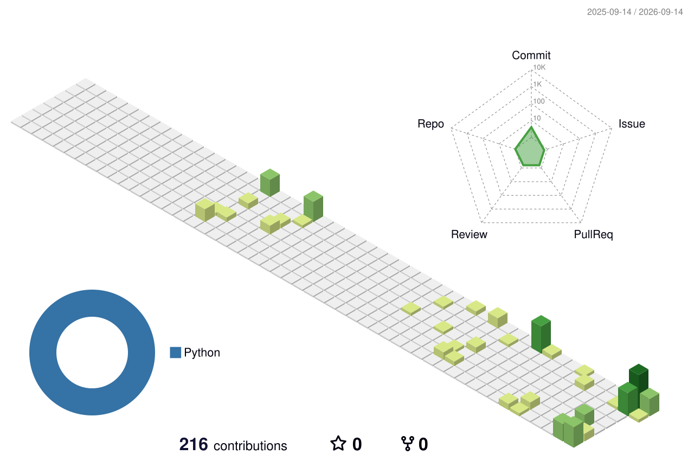

<p align="center">
  <picture>
    <source media="(prefers-color-scheme: dark)" srcset="./assets/hero-dark.svg">
    <source media="(prefers-color-scheme: light)" srcset="./assets/hero-light.svg">
    
  </picture>
</p>

<p align="center">
  <a href="https://www.linkedin.com/in/leozaow/">
    
  </a>
  <a href="http://lattes.cnpq.br/9852823759546906">
    
  </a>
</p>

```console
$ sysinfo --whoami

  IDENTITY   Leandro Barbosa
  TAGLINE    FROM RULES → SYSTEMS
  DOMAIN     Public Management · Institutional Governance
  LOGIC      Legal Reasoning · Constraints, Exceptions & Invariants
  ENGINE     OpenAI Codex × Google Antigravity
  PIPELINE   Rules ──▶ Operational Reality ──▶ AI Agents ──▶ Working Systems
  MODE       Vibe Coding
```

### ⚡ The Intersection

Most software breaks at the specification level — where edge cases, regulations, and institutional realities are overlooked.

I build at the crossroads of **domain expertise** and **agentic leverage**:

* **⚖️ Law** gives the constraints — norms, statutory boundaries, and invariants.
* **🏛️ Public Management** gives the context — institutional reality, auditability, and compliance.
* **🤖 AI Coding Agents** provide the execution — compiling domain logic directly into working tools with **OpenAI Codex** and **Google Antigravity**.

<br>

### 🕹️ Contributions, but make it playable

<picture>
  <source media="(prefers-color-scheme: dark)" srcset="https://raw.githubusercontent.com/leozaow/leozaow/output/pacman-contribution-graph-dark.svg">
  <source media="(prefers-color-scheme: light)" srcset="https://raw.githubusercontent.com/leozaow/leozaow/output/pacman-contribution-graph.svg">
  
</picture>

<br>

### 🧊 Activity in 3D

<picture>
  <source media="(prefers-color-scheme: dark)" srcset="./profile-3d-contrib/profile-night-green.svg">
  <source media="(prefers-color-scheme: light)" srcset="./profile-3d-contrib/profile-green-animate.svg">
  
</picture>

<br>

### 🔥 Build streak

<p align="center">
  <picture>
    <source media="(prefers-color-scheme: dark)" srcset="./assets/streak.dark.svg">
    <source media="(prefers-color-scheme: light)" srcset="./assets/streak.light.svg">
    
  </picture>
</p>

<br>

<div align="center">
  <sub><strong>Law</strong> gives me constraints · <strong>public management</strong> gives me context · <strong>AI agents</strong> give me leverage.</sub>
</div>
