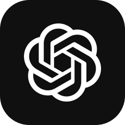
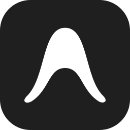
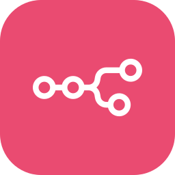
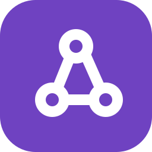

  <picture>
    <source media="(prefers-color-scheme: dark)" srcset="./assets/hero-dark.svg?v=synapse-motion-3">
    <source media="(prefers-color-scheme: light)" srcset="./assets/hero-light.svg?v=synapse-motion-3">
    
  </picture>

  
  

Atuo na Administração Pública. Uso automação, dados e inteligência artificial para melhorar processos e construir soluções digitais a partir de necessidades reais do trabalho. Minha formação em Direito contribui para esse olhar sobre regras e processos.

### Ferramentas de trabalho

#### Automação e integração

  
  
  
  
  
  

#### Desenvolvimento e infraestrutura

  

#### Dados e nuvem

  

 

### Contribuições · Formiga de Langton

Uma implementação autoral que usa minhas contribuições reais como condição inicial do autômato.

<picture>
  <source media="(prefers-color-scheme: dark)" srcset="https://raw.githubusercontent.com/leozaow/leozaow/output/langton-contribution-graph-dark.svg">
  <source media="(prefers-color-scheme: light)" srcset="https://raw.githubusercontent.com/leozaow/leozaow/output/langton-contribution-graph.svg">
  
</picture>

 

### Estatísticas e sequência

  <picture>
    <source media="(prefers-color-scheme: dark)" srcset="https://raw.githubusercontent.com/leozaow/leozaow/refs/heads/main/assets/streak.dark.svg?v=flame-position-2">
    <source media="(prefers-color-scheme: light)" srcset="https://raw.githubusercontent.com/leozaow/leozaow/refs/heads/main/assets/streak.light.svg?v=flame-position-2">
    
  </picture>

