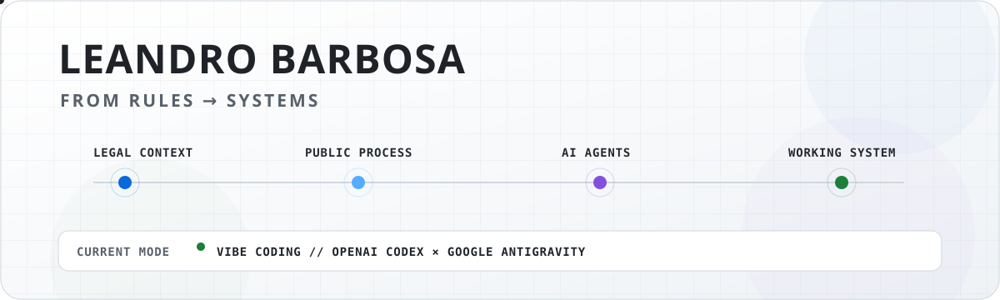

  <picture>
    <source media="(prefers-color-scheme: dark)" srcset="./assets/hero-dark.svg">
    <source media="(prefers-color-scheme: light)" srcset="./assets/hero-light.svg">
    
  </picture>

  

### 🛠️ Stack & Tecnologias

  <!-- Agentes & Automação Core -->
  
  
  
  
  
   
  <!-- Linguagens & Runtime -->
  
  
  
  
  
   
  <!-- Dados & Cloud -->
  
  
  
  

 

### 🕹️ Contribuições

<picture>
  <source media="(prefers-color-scheme: dark)" srcset="https://raw.githubusercontent.com/leozaow/leozaow/output/pacman-contribution-graph-dark.svg">
  <source media="(prefers-color-scheme: light)" srcset="https://raw.githubusercontent.com/leozaow/leozaow/output/pacman-contribution-graph.svg">
  
</picture>

 

### 🔥 Estatísticas & Sequência

  <picture>
    <source media="(prefers-color-scheme: dark)" srcset="./assets/streak.dark.svg">
    <source media="(prefers-color-scheme: light)" srcset="./assets/streak.light.svg">
    
  </picture>

